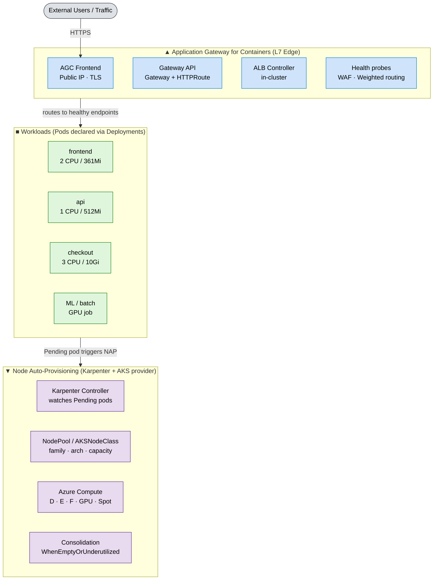

# Build a Self-Managing AKS Platform with NAP + Application Gateway for Containers

> **Subtitle:** How Node Auto-Provisioning and Application Gateway for Containers eliminate the two hardest jobs in Kubernetes infrastructure — picking compute and wiring ingress.

**Author:** Vyshnavi Namani
**Audience:** Platform engineers, AKS architects, FinOps leads, Microsoft LT

---

## TL;DR

Two of the most painful jobs in running Kubernetes — **picking the right node pools** and **wiring up ingress** — can now be delegated to AKS itself.

- **NAP (Node Auto-Provisioning)** watches your pending pods, picks the optimal Azure VM SKU, provisions it, places the pod, and consolidates idle nodes when demand drops.
- **AGC (Application Gateway for Containers)** is the next-gen L7 ingress for AKS, built on the Kubernetes Gateway API. It autoscales itself, auto-discovers pod endpoints, and handles TLS / WAF / weighted routing.

Together, they turn an AKS cluster into a platform that **responds to workload intent** instead of forcing you to pre-plan infrastructure.

---

## The Two Walls Every Platform Team Hits

If you've run Kubernetes at scale, you've hit both of these:

| Wall | What it feels like | The cost |
| --- | --- | --- |
| **Compute guessing game** | "Which VM size? How many node pools? What if the workload changes?" | Over-provisioned pools sitting idle 70% of the time, OR pods stuck `Pending` because no pool fits |
| **Ingress configuration maze** | Hand-rolled Ingress YAML, manual LB rules, fragile health probes | Slow rollouts, brittle traffic shifts, every team rebuilds the same wheel |

AKS now has purpose-built answers for both.

---

## Architecture at a Glance



> 📎 **For LT decks:** the polished Excalidraw version is in `nap-agc-architecture.excalidraw` (and exported PNG). It includes a yellow "Why it matters" insight band ready to drop into a slide.

The relationship is clean:

- **AGC** manages the **front door** — how traffic enters and routes to your pods.
- **NAP** manages the **floor plan** — what compute exists to run those pods.
- They are **independent but complementary.** AGC's health probes auto-include/exclude pods as NAP provisions and terminates nodes. Neither requires you to pre-plan infra.

---

## How NAP Works (in 5 lines)

1. A pod lands in `Pending` — no existing node satisfies its request.
2. NAP reads the pod spec: CPU, memory, GPU, arch, affinity, tolerations.
3. It evaluates allowed Azure VM SKUs and picks the most cost-efficient fit.
4. It launches a VM and places the pod.
5. When utilization drops, **consolidation** removes the VM. You stop paying.

NAP is built on **open-source Karpenter** with a dedicated **AKS provider**. AKS deploys, configures, and manages Karpenter for you — you just describe intent via two CRDs:

```yaml
apiVersion: karpenter.sh/v1
kind: NodePool
metadata: { name: default }
spec:
  disruption:
    consolidationPolicy: WhenEmptyOrUnderutilized
    consolidateAfter: 30s
  template:
    spec:
      nodeClassRef: { group: karpenter.azure.com, kind: AKSNodeClass, name: default }
      requirements:
        - { key: kubernetes.io/arch,                operator: In, values: ["amd64"] }
        - { key: karpenter.sh/capacity-type,        operator: In, values: ["on-demand"] }
        - { key: karpenter.azure.com/sku-family,    operator: In, values: ["D"] }
```

That's it. No node pool sprawl. No autoscaler tuning. No capacity-planning meetings.

### Limits to know

- Requires **Azure CNI Overlay + Cilium** dataplane.
- Cannot coexist with cluster autoscaler on the same cluster.
- No Windows node pools, no IPv6, no custom kubelet config.
- Managed identity only (no SPNs).

---

## How AGC Works (in 5 lines)

1. You install the **ALB Controller** add-on in AKS.
2. You declare a Gateway API `Gateway` + `HTTPRoute` in your cluster.
3. The controller provisions/updates the **AGC** Azure resource for you.
4. AGC discovers pod endpoints via the Service and probes their health.
5. Traffic flows. As pods come and go, AGC routing adapts in seconds.

```yaml
apiVersion: gateway.networking.k8s.io/v1
kind: HTTPRoute
metadata: { name: app-route }
spec:
  parentRefs: [{ name: my-gateway }]
  rules:
    - matches: [{ path: { type: PathPrefix, value: /api } }]
      backendRefs: [{ name: api-service, port: 80 }]
    - matches: [{ path: { type: PathPrefix, value: / } }]
      backendRefs: [{ name: frontend-service, port: 80 }]
```

You get path/header routing, weighted traffic shifting, mTLS, gRPC, WebSocket, WAF, and **independent autoscale of the AGC tier itself** — out of the box.

---

## The Collaboration: Why NAP + AGC Is Greater Than the Sum

| Layer | Without NAP + AGC | With NAP + AGC |
| --- | --- | --- |
| Compute | Pre-plan node pools, pick VM sizes, tune autoscaler | NAP picks right-sized VMs on demand |
| Routing | Hand-rolled Ingress YAML, fixed-tier LB | AGC programmed via Gateway API, autoscales itself |
| Scaling | Pods stuck if no node matches | NAP eliminates the "no node" blocker; AGC routes immediately |
| Cost | Idle buffer nodes 24×7 | Right-sized VMs + consolidation + Spot option |
| Ops | Multiple node pools to babysit | One `NodePool` CRD; AGC is self-managed |

**The integration moment:** as NAP launches a new node and pods become `Ready`, AGC's health probes pick them up — **no AGC config change, no LB restart**. The system converges.

---

## Demo Scenario: Flash Sale on a Multi-Service App

A 3-service e-commerce app — `frontend`, `api`, `checkout` — fronted by AGC.

1. Traffic spikes 10×. HPA scales `frontend` and `api` pods.
2. New pods land `Pending` — existing nodes are saturated.
3. **NAP fires:** provisions `Standard_D4s_v5` for the CPU-bound services, `Standard_E8s_v5` for the memory-bound `checkout`.
4. Pods become `Running`. **AGC auto-includes them** in the backend pool — zero routing changes.
5. Sale ends. Pods scale down. NAP **consolidates** underutilized nodes. AGC drops them via probes.

**Result:** the platform absorbed a 10× event and cleaned itself up. Zero human intervention.

---

## Cost Story (the slide LT will care about)

| Posture | Traditional pools | NAP + AGC |
| --- | --- | --- |
| Idle buffer capacity | 3 pools × min nodes, 24×7 | 0 — VMs appear on demand |
| VM right-sizing | One-size-fits-pool | Per-workload SKU selection |
| Spot exploitation | Manual, per-pool | `capacityType: Spot` in NodePool |
| Idle teardown | Manual or autoscaler tuning | Karpenter consolidation, automatic |
| L7 ingress tier | Fixed SKU paid 24×7 | AGC autoscales independently |

**Best-fit savings scenarios:**

- **Batch / ML / GPU jobs** — VMs only exist while the job runs.
- **Dev/test** — Spot capacity for massive reduction.
- **Bursty web traffic** — no idle buffer, capacity tracks demand.
- **Mixed workloads** — single cluster, many SKUs, no pool sprawl.

---

## Professional Insights (from building the demo)

1. **Pair NAP with KEDA + VPA, not HPA alone.** HPA gives you horizontal pod scale; KEDA reacts to event sources (queue depth, Kafka lag); VPA right-sizes pod requests so NAP picks the right VM. This trio is the real "self-managing" loop.
2. **Start with one `NodePool` and a wide SKU family** (e.g., `D`). Resist the urge to recreate node pool sprawl as multiple NodePools on day one. Let workload requirements pull diversity out of NAP, then split NodePools only when you need workload isolation.
3. **Use Spot deliberately.** Add a second `NodePool` with `capacityType: Spot` and a taint; let batch / dev workloads tolerate it. You'll see double-digit savings without touching production routing.
4. **Treat AGC's `Gateway` as a platform contract.** App teams own `HTTPRoute`s; the platform team owns `Gateway`s. This is the Gateway API's intended split-of-concerns and it scales beautifully.
5. **Watch consolidation in production.** `WhenEmptyOrUnderutilized` + `consolidateAfter: 30s` is aggressive. For latency-sensitive prod, lengthen `consolidateAfter` and add `disruption.budgets` to cap churn during business hours.
6. **NAP doesn't replace observability.** Wire Karpenter events into Container Insights / Prometheus. The signal "NAP launched an `E16s_v5`" is gold for capacity reviews.
7. **Migration nuance:** you cannot turn NAP on for a cluster that already runs the cluster autoscaler. Plan a green/blue cluster cut-over rather than an in-place flip.

---

## Getting Started

```bash
# 1. Create AKS with NAP enabled
az aks create -n my-cluster -g my-rg \
  --network-plugin azure --network-plugin-mode overlay \
  --network-dataplane cilium \
  --node-provisioning-mode Auto

# 2. Enable AGC's ALB Controller add-on
az aks addon enable -n my-cluster -g my-rg --addon alb-controller

# 3. Apply your NodePool, Gateway, HTTPRoute, Deployment
kubectl apply -f nodepool.yaml -f gateway.yaml -f app.yaml
```

The cluster handles the rest.

---

## Summary

- **NAP** = right compute, right size, right time — automatically.
- **AGC** = right routing, right health management, right scale — automatically.
- **Together** = a self-managing AKS platform with materially lower ops burden and a real cost story.

📚 **References**

- [Node Auto-Provisioning overview (AKS docs)](https://learn.microsoft.com/azure/aks/node-autoprovision)
- [Application Gateway for Containers overview](https://learn.microsoft.com/azure/application-gateway/for-containers/overview)
- [Karpenter (open source)](https://karpenter.sh)
- [Kubernetes Gateway API](https://gateway-api.sigs.k8s.io)
