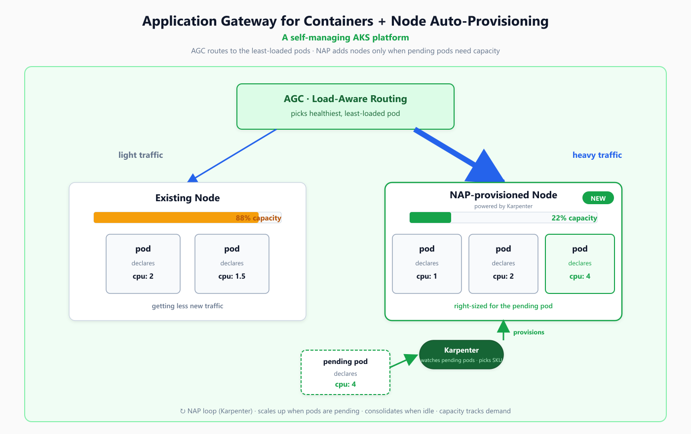

# Application Gateway for Containers (AGC) + Node Auto-Provisioning (NAP) Demo

End-to-end demo showing how two AKS capabilities work together to turn a cluster into a self-managing platform that scales with demand and shrinks when demand drops:

- **Application Gateway for Containers (AGC)** — Azure-managed Layer-7 ingress that auto-discovers pod endpoints and routes traffic **load-aware** (least-loaded healthy pod gets new connections).
- **Node Auto-Provisioning (NAP)** — in-cluster Karpenter that reads pending pod specs, picks the right Azure VM SKU, provisions it, and **consolidates** idle nodes when demand drops.

The demo is built around a realistic customer scenario (Contoso Retail flash-sale) so each command has business context, not just a kubectl invocation.



---

## Customer Scenario — Contoso Retail

Contoso Retail runs `shop.contoso.com` on AKS. Their platform team is preparing for a holiday flash sale and faces three concrete problems:

| # | Problem the platform team wants solved | What we will prove on the cluster |
|---|---|---|
| 1 | "We don't know what VM SKU to put in the node pool. Pick small and pods stay Pending. Pick big and we burn money." | NAP reads the pod spec and picks a right-sized SKU automatically. |
| 2 | "When marketing sends the email blast, traffic spikes 5x. We need new pods placed fast — and existing pods must not get hammered while the new ones come up." | NAP launches a node within ~60s **and** AGC routes new traffic to the cool pods first. |
| 3 | "After the sale, the extra capacity sits idle on the bill all night." | NAP detects under-utilization and terminates the extra node automatically. |

Each demo step maps back to one of these three problems.

---

## Architecture

```
                    Internet
                       │
                       ▼
   ┌─────────────────────────────────────────┐
   │ Application Gateway for Containers      │  Azure-managed L7
   │ (AGC frontend, public FQDN)             │  Outside the cluster
   └─────────────────────────────────────────┘
                       │
                       │  Load-aware routing:
                       │  least-loaded healthy pod first
                       ▼
   ┌──────────────── AKS cluster ───────────────────────────┐
   │ Gateway API:                                           │
   │   gateway-01 (gatewayClassName: azure-alb-external)    │
   │   └─ HTTPRoute shop → svc/shop :80                     │
   │                                                        │
   │ ALB Controller (in-cluster add-on)                     │
   │   programs the AGC frontend over Azure ARM             │
   │                                                        │
   │ Karpenter / Node Auto-Provisioning                     │
   │   watches Pending pods → reads cpu/memory/arch/spot    │
   │   → calls AKS API → VM joins → kubelet schedules pods  │
   │                                                        │
   │ Existing node                NAP-provisioned node      │
   │   shop-v1 pod  (busy)          shop-v1 pod  (cool)     │
   │   shop-v1 pod  (busy)          shop-v1 pod  (cool)     │
   │                                shop-v1 pod  (cool)     │
   └────────────────────────────────────────────────────────┘
```

**Key things to notice in the diagram:**

- AGC is **outside** the cluster. It is an Azure resource. The in-cluster ALB Controller programs it via Azure ARM whenever you change a `Gateway` or `HTTPRoute`.
- Pods declare CPU. When a Pending pod cannot fit any current node, NAP creates a node sized to fit it.
- AGC's load-aware algorithm sends the next connection to the **least-loaded** healthy pod, so the cool pods on the new node absorb the spike instead of the already-busy pods.

---

## Prerequisites

| Requirement | Notes |
|---|---|
| Azure subscription | Owner or Contributor on the subscription |
| Azure CLI | Version **2.76.0 or later** (`az version`). Run `az upgrade --yes` if older. |
| `aks-preview` CLI extension | `az extension add --name aks-preview --upgrade --allow-preview true` |
| `alb` CLI extension | `az extension add --name alb --upgrade --allow-preview true` |
| `kubectl` | `az aks install-cli` if missing |
| Bash | Linux, macOS, WSL, or Git Bash on Windows |
| Region with NAP and AGC capacity | `eastus2`, `westus3`, `westeurope` recommended |

**Provider registration (one-time per subscription):**

```bash
az provider register --namespace Microsoft.ContainerService  --wait
az provider register --namespace Microsoft.ServiceNetworking --wait
```

> NAP is now generally available in AKS — there is no preview feature flag to register.

**NAP constraints to know up front:**

- Requires Azure CNI Overlay with the Cilium dataplane.
- Cannot coexist with the cluster autoscaler.
- No Windows node pools, no IPv6, no custom kubelet config.
- Managed identity only (no service principals).

---

## Repository Layout

```
nap-agc-demo/
├── README.md                       <-- you are here
├── BLOG.md                         long-form write-up
├── DEMO-SCRIPT.md                  minute-by-minute live demo script
├── docs/
│   └── architecture.png            customer-facing diagram
├── scripts/
│   ├── 00-env.sh                   environment variables (source this first)
│   ├── 01-prereqs.sh               register providers/features, create RG
│   ├── 02-create-aks.sh            create AKS with Cilium + NAP + AGC add-on
│   ├── 03-deploy-workloads.sh      apply NodePool, Service, Gateway, baseline pods
│   ├── 04-flash-sale.sh            trigger the marketing-blast scenario
│   ├── 05-verify.sh                PASS/FAIL test suite
│   ├── 06-load-test.sh             generate traffic to prove load-aware routing
│   └── 99-cleanup.sh               delete the resource group
└── manifests/
    ├── nodepool.yaml               NAP NodePool (D-family + E-family + spot)
    ├── nginx-service.yaml          Service that AGC fronts
    ├── gateway.yaml                Gateway + HTTPRoute (AGC)
    ├── deployment-small.yaml       baseline shop-v1 (light)
    └── deployment-large.yaml       flash-sale recommendation engine (heavy)
```

---

## Run It

From the repository root:

```bash
# 1. Edit demo/scripts/00-env.sh if you want a different region or names, then:
source scripts/00-env.sh
az login
az account set --subscription "$SUBSCRIPTION_ID"

# 2. Register providers and features, create the resource group (~3 min the first time)
bash scripts/01-prereqs.sh

# 3. Create the AKS cluster with Cilium + NAP + AGC add-on (~7 min)
bash scripts/02-create-aks.sh

# 4. Apply the NodePool, Service, Gateway, and baseline workload (~3 min)
bash scripts/03-deploy-workloads.sh

# 5. Trigger the flash-sale scenario: heavy workload + scale-up (~3 min)
bash scripts/04-flash-sale.sh

# 6. Verify everything reached the expected state
bash scripts/05-verify.sh

# 7. (Optional) Generate sustained traffic to demonstrate load-aware routing
bash scripts/06-load-test.sh
```

If you want narration, pacing, and "pause-the-camera" reveal moments for a live presentation, follow [DEMO-SCRIPT.md](./DEMO-SCRIPT.md) instead — it walks through the same scripts but with talking points.

---

## What Each Step Does

### Step 1 — Prerequisites and resource group (`01-prereqs.sh`)

Registers the two preview features (`NodeAutoProvisioningPreview` and the AGC service-networking provider), installs the `aks-preview` and `alb` CLI extensions, and creates the resource group.

> **For beginners:** Azure preview features are off by default per subscription. You only need to register them once, but the registration itself can take a few minutes — the script polls until it reads `Registered`.

### Step 2 — Create the AKS cluster (`02-create-aks.sh`)

Creates the AKS cluster with the three things this demo needs:

| Flag | What it does | Why we need it |
|---|---|---|
| `--network-plugin azure --network-plugin-mode overlay` | Azure CNI Overlay | Required by NAP |
| `--network-dataplane cilium` | Cilium eBPF dataplane | Required by NAP |
| `--node-provisioning-mode Auto` | Enables NAP (Karpenter under the hood) | Lets the cluster pick its own VM SKUs |

Then enables the **ALB Controller** add-on (`az aks addon enable --addon application-load-balancer`) which is the in-cluster component that programs AGC.

> **For beginners:** The ALB Controller is a Pod (actually a Deployment in the `kube-system` namespace). When you create a `Gateway` resource in the cluster, the ALB Controller sees it and calls Azure ARM to create the matching AGC frontend in your subscription. You never click around the Azure Portal to provision AGC — you just write Kubernetes YAML.

### Step 3 — Deploy baseline workload (`03-deploy-workloads.sh`)

Applies four Kubernetes resources in order:

1. `manifests/nodepool.yaml` — The **NodePool** is your only NAP configuration. It tells Karpenter what SKU families it is allowed to choose from (D-series and E-series here), whether spot is OK, and how aggressive consolidation should be. **You do not list specific SKUs.** Karpenter picks the cheapest one that fits.
2. `manifests/nginx-service.yaml` — A Kubernetes `Service` of type `ClusterIP`. AGC routes to this Service.
3. `manifests/gateway.yaml` — A `Gateway` (AGC frontend) and an `HTTPRoute` (`/` → `shop` Service). When this is applied, the ALB Controller programs the AGC frontend in Azure.
4. `manifests/deployment-small.yaml` — Two `shop-v1` pods, each requesting **2 CPU / 361 Mi**. This represents Contoso's normal traffic baseline.

When the small Deployment is applied, the two pods go `Pending` because the cluster only has the system node. Karpenter sees them and calls the AKS API to provision a node sized to fit. About 60 seconds later, both pods are `Running` on a brand-new D-family VM.

> **For beginners:** Watch the right-top pane — every action shows up there as a Karpenter event. The line you are looking for is `Launched instance: Standard_D...`.

### Step 4 — Trigger the flash sale (`04-flash-sale.sh`)

Two things happen in sequence:

1. Apply `manifests/deployment-large.yaml` — the **recommendation engine**. Three pods, each requesting **4 CPU / 10 Gi memory**. The existing D-family node has only ~15 Gi free, so the pods go Pending. Karpenter sees the memory shape and picks an **E-family memory-optimized** VM (different family from before — this is the proof point).
2. Scale the baseline `shop-v1` Deployment from 2 → 6 pods. Now there are six light pods plus three heavy pods. The cluster ends up with two right-sized nodes (one D for the lights, one E for the heavies), pods correctly bin-packed onto each.

> **For beginners:** This step proves that NAP doesn't just "add a node." It picks the **right shape** of node based on what the pending pods actually need. A traditional cluster autoscaler can only scale within node pools you defined ahead of time.

### Step 5 — Verify (`05-verify.sh`)

Runs a PASS/FAIL test suite that checks:

- NodePool is `Ready`
- At least one `Standard_D*` node exists
- At least one `Standard_E*` node exists (provisioned during the flash-sale step)
- All `shop-v1` and `recommender` pods are `Running`
- Gateway has an address populated
- HTTP `GET` against the AGC address returns `200`

### Step 6 — Load test (`06-load-test.sh`, optional)

Runs a pod inside the cluster that hits the AGC endpoint repeatedly for 60 seconds, then prints the distribution of responses across pod IPs. AGC's load-aware algorithm should send most requests to the **cool** pods on the newly-provisioned node, not the already-busy pods.

> **For beginners:** This is what makes AGC different from a round-robin load balancer. Round-robin sends the next request to the next pod in the list, regardless of how loaded it is. AGC tracks endpoint load (active connections, recent latency) and prefers cooler pods.

### Step 7 — Wait for consolidation (no script — just observe)

Scale the heavy Deployment to zero:

```bash
kubectl scale deployment recommender --replicas=0
```

Within a few minutes, Karpenter detects the E-node is under-utilized and removes it. You will see:

```
Disrupting          nodeclaim/...   via consolidation: replace
Terminating         nodeclaim/...
Deleted             node/...
```

This is the cost-savings proof point — the VM literally disappears from your bill.

---

## Validation

After the scripts complete, the cluster should be in this state:

| Check | Command | Expected result |
|---|---|---|
| NodePool ready | `kubectl get nodepool` | `READY=True` |
| Two SKU families present | `kubectl get nodes --show-labels \| grep karpenter.azure.com/sku-name` | one `Standard_D*` and one `Standard_E*` |
| All shop pods running | `kubectl get pods -l app=shop-v1` | all `Running` (6 pods after Step 4) |
| All recommender pods running | `kubectl get pods -l app=recommender` | all `Running` (3 pods) |
| Gateway programmed | `kubectl get gateway gateway-01 -o jsonpath='{.status.conditions[?(@.type=="Programmed")].status}'` | `True` |
| AGC reachable | `curl -s -o /dev/null -w "%{http_code}" http://$(kubectl get gateway gateway-01 -o jsonpath='{.status.addresses[0].value}')/` | `200` |
| Load-aware routing | `bash scripts/06-load-test.sh` | new requests skewed toward cool pods on the NAP-provisioned node |

**Karpenter event cheat-sheet** (right-top pane during the demo):

| Event | Meaning |
|---|---|
| `NominatePod` | Karpenter claimed a Pending pod |
| `NodeClaimCreated` | Decision made, spinning up VM |
| `Launched instance: Standard_<SKU>` | The reveal — Karpenter picked the SKU |
| `Initialized` | Node is `Ready`, pods can bind |
| `Disrupting via consolidation: replace` | Under-utilized node being removed |
| `Deleted NodeClaim` | VM terminated, billing stops |

---

## Troubleshooting

| Symptom | Likely cause | Fix |
|---|---|---|
| `az aks create` fails on `--node-provisioning-mode` | Base `az` CLI older than 2.76.0 — `aks-preview` extension expects the newer network-profile shape | `az upgrade --yes` (or `winget upgrade --id Microsoft.AzureCLI` on Windows), then `az extension add --name aks-preview --upgrade --allow-preview true` |
| `too many values to unpack (expected 3)` traceback during `az aks create` | Same root cause as above — `aks-preview` ↔ base CLI version mismatch | Same fix: `az upgrade --yes` + refresh `aks-preview` |
| `FeatureNotFound: NodeAutoProvisioningPreview` | NAP went GA — that preview flag no longer exists | Skip the `az feature register` step; just register the providers and continue |
| `az aks create` fails on `--network-dataplane cilium` | `aks-preview` extension stale | `az extension update --name aks-preview` |
| `kubectl get nodepool` returns `No resources found` | NAP CRDs not installed (NAP not enabled) | Verify `az aks show -n $CLUSTER -g $RG --query nodeProvisioningProfile.mode` returns `Auto` |
| Pods stuck `Pending`, no Karpenter event fires | Pod requirements outside NodePool's `requirements` block (arch, sku-family, capacity-type) | Edit `manifests/nodepool.yaml` to widen the `requirements` block |
| Karpenter event: `no instance type satisfied resources` | Pod request exceeds any VM in the allowed families | Add another `sku-family` (e.g. `F`) to the NodePool |
| Gateway `ADDRESS` stays empty | ALB Controller add-on disabled or pods not Ready | `kubectl get pods -n kube-system \| grep alb-controller` — pods should be `Running`. If missing: `az aks update -n $CLUSTER -g $RG --enable-gateway-api --enable-application-load-balancer` |
| `Addon applicationLoadBalancer is invalid` | `ApplicationLoadBalancerPreview` and/or `ManagedGatewayAPIPreview` features not registered, or cluster lacks workload identity | Re-run `bash scripts/01-prereqs.sh` to register both preview features, then `az aks update -n $CLUSTER -g $RG --enable-oidc-issuer --enable-workload-identity` before enabling the add-on |
| `curl <AGC-IP>` returns `502` | Backend pods not Ready or wrong port in Service | `kubectl get endpoints shop` — endpoints list should not be empty; check Service `targetPort` matches container port |
| Consolidation never fires | `consolidationPolicy` is not `WhenEmptyOrUnderutilized`, or `disruption.budgets` is blocking | `kubectl get nodepool default -o yaml` — confirm policy and lower `consolidateAfter` if needed |
| Spot node terminated mid-demo | Azure spot eviction (expected behavior) | Pods automatically reschedule. If you do not want this during a recording, remove `spot` from `capacity-type` in the NodePool |
| `kubectl` complains about missing CRDs (`karpenter.sh/v1`) | NAP enabled with an older API version | `kubectl api-resources \| grep karpenter` to confirm version, update YAML `apiVersion` accordingly |
| AGC subnet association fails (`Microsoft.ServiceNetworking InternalServerError`) | Region capacity issue | Try `westus3` or `westeurope` |

---

## Cleanup

```bash
bash scripts/99-cleanup.sh
```

This deletes the resource group, which removes the AKS cluster, the AGC frontend, the managed identity, the public IP, and any disks NAP provisioned.

If you only want to reset between takes (without deleting the cluster):

```bash
kubectl scale deployment recommender --replicas=0
kubectl scale deployment shop-v1 --replicas=2
```

Wait a few minutes for consolidation, then re-run `scripts/04-flash-sale.sh` to repeat the scenario.

---

## References

**Microsoft Learn:**

- [Node Auto-Provisioning overview](https://learn.microsoft.com/azure/aks/node-autoprovision)
- [Configure NAP NodePools](https://learn.microsoft.com/azure/aks/node-autoprovision#configure-nodepools)
- [Application Gateway for Containers overview](https://learn.microsoft.com/azure/application-gateway/for-containers/overview)
- [AGC quickstart with ALB Controller](https://learn.microsoft.com/azure/application-gateway/for-containers/quickstart-deploy-application-gateway-for-containers-alb-controller)
- [Gateway API on AKS (HTTPRoute)](https://learn.microsoft.com/azure/application-gateway/for-containers/how-to-traffic-splitting-gateway-api)
- [Azure CNI Overlay with Cilium](https://learn.microsoft.com/azure/aks/azure-cni-powered-by-cilium)
- [AKS load-aware routing concepts](https://learn.microsoft.com/azure/application-gateway/for-containers/traffic-management-overview)

**Open-source projects:**

- [Karpenter](https://karpenter.sh)
- [Kubernetes Gateway API](https://gateway-api.sigs.k8s.io)

---

## Further Reading

- [BLOG.md](./BLOG.md) — long-form write-up: how each piece works, the cost story, lessons learned.
- [DEMO-SCRIPT.md](./DEMO-SCRIPT.md) — minute-by-minute live demo script with narration and pause moments.
